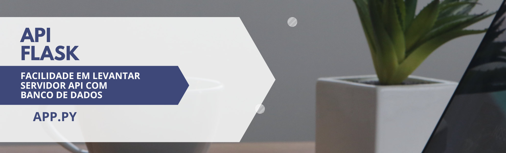

# Facilities Flask API

 O API_FLASK_FACILITIES é um software que oferece uma maneira simples e eficiente de criar APIs com Flask, juntamente com a implementação de um banco de dados local. Com essa ferramenta, é possível criar APIs em questão de minutos, sem a necessidade de uma grande expertise em programação ou em Flask.  

## Porque usar a Facilities FLASK API?

 Uma das grandes vantagens do API_FLASK_FACILITIES é a facilidade em manipular o banco de dados local. Isso acontece porque a passagem de dados é feita por meio da URL, o que torna todo o processo muito intuitivo. Além disso, essa abordagem permite que a API seja facilmente integrada a outras aplicações.  Outra vantagem do API_FLASK_FACILITIES é a sua facilidade de criação. Com poucas linhas de código é possível implementar uma API com todas as funcionalidades necessárias, como rotas, métodos e autenticação de usuários. Isso torna o processo de criação muito mais rápido e eficiente, reduzindo o tempo e os custos necessários para implementar uma API completa.  O software também é altamente personalizável, permitindo que os usuários criem suas próprias rotas e métodos de acordo com suas necessidades específicas. Além disso, o API_FLASK_FACILITIES é altamente escalável, o que significa que ele pode ser facilmente adaptado para atender a demandas de maior volume.  

## Equipe de desenvolvimento

#### > Marco Antonio

#### > Jean

## Ferramentas

#### > VSCODE && PYTHON && FLASK

#### > FIGMA && CANVA
